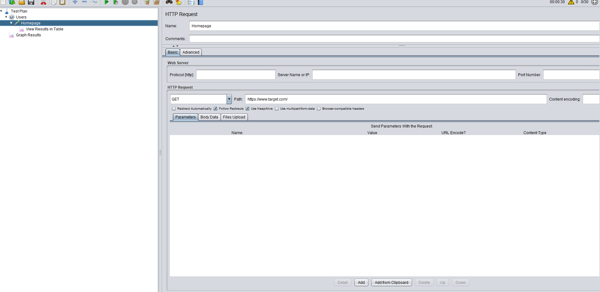
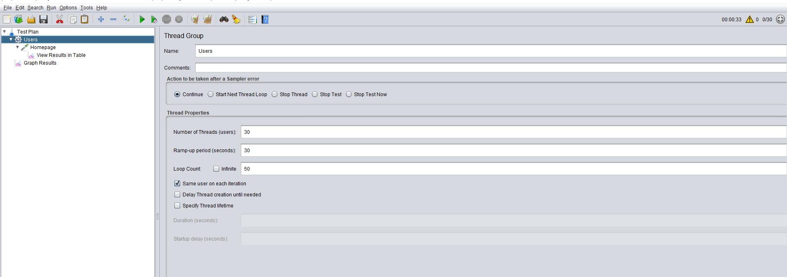
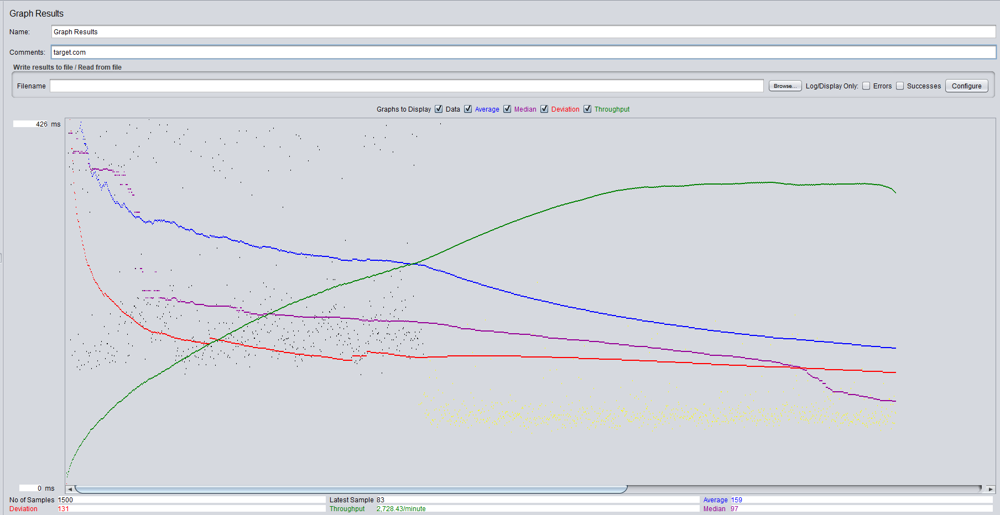
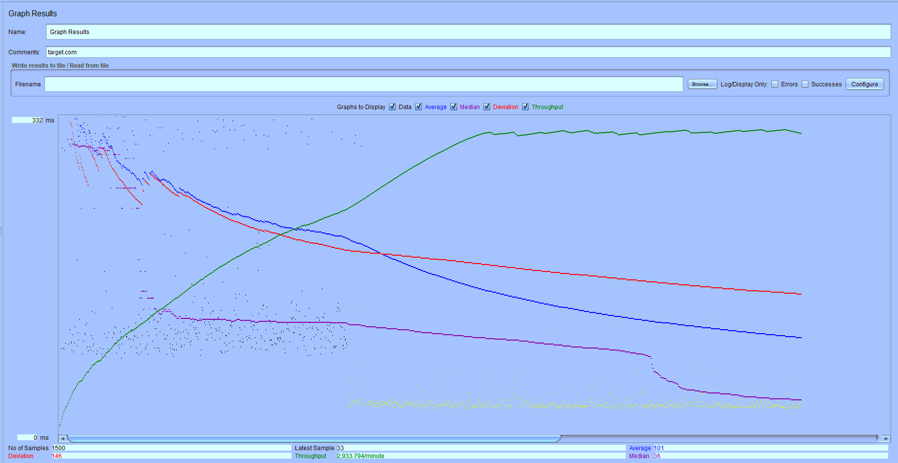
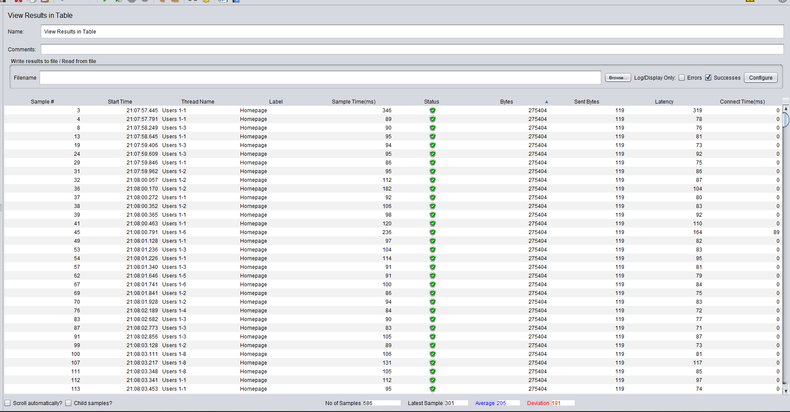

### Performance Testing Using Jmeter

This test was ran twice against the target.com homepage. Request pictured below:

 

The thread group named Users consisted of 30 threads looping 50 times over a 30 second period. Seen below:

 

The first run had a 426 ms response time, with a 159 average, 97 median and deviation of 131.  
The second run had a 332 ms response time, with a 101 average, 36 median and a deviation of 146. 
 
 I found the response time to be adequate since both were under half a second. Same with the average and median of both runs. 

 The throughput for both runs tested the way I had anticipated. Ramping up then becoming fairly consistent. 
It's a good sign that there were no plummets which could signal a bottleneck. It is also good that it leveled out with user response times lessening.
 

 I think the deviation is a bit odd with test two. The average and median is better in test two, but the deviation higher. 
 
In conclusion, I found this site to have a high performance with no major calls for concern. 
  

Test One Graph below:

 
 
Test Two Graph below:

 
 

 additional Table image below:
